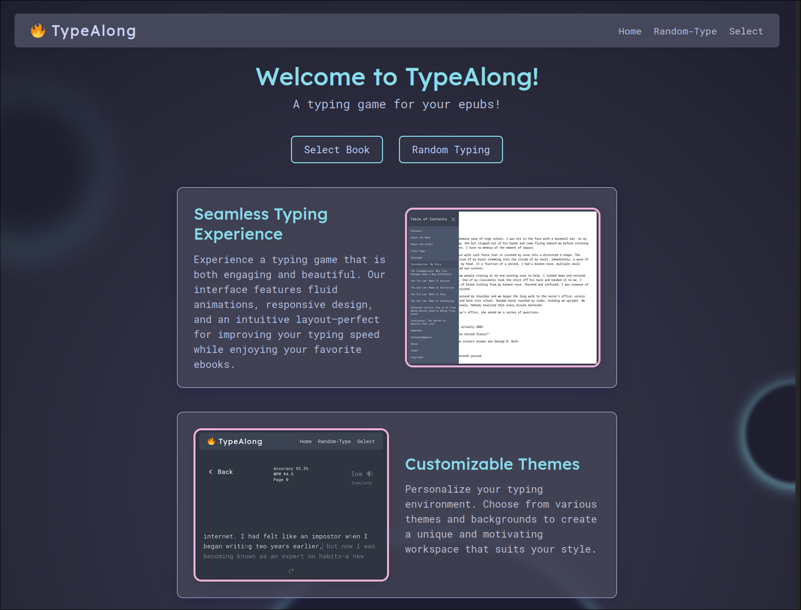
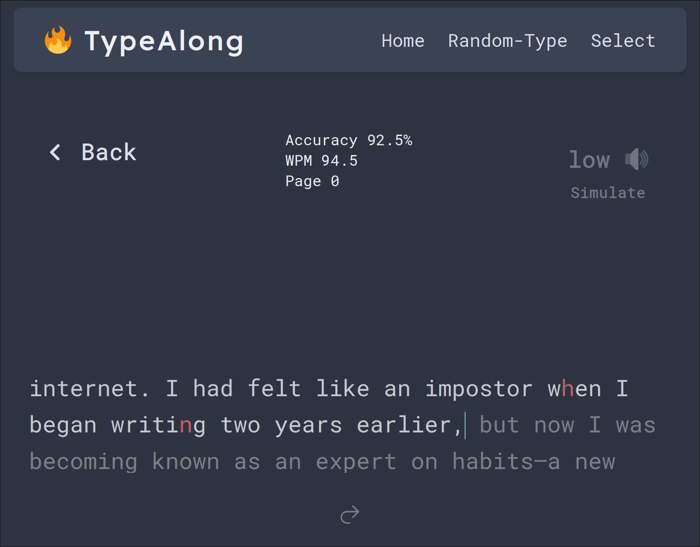
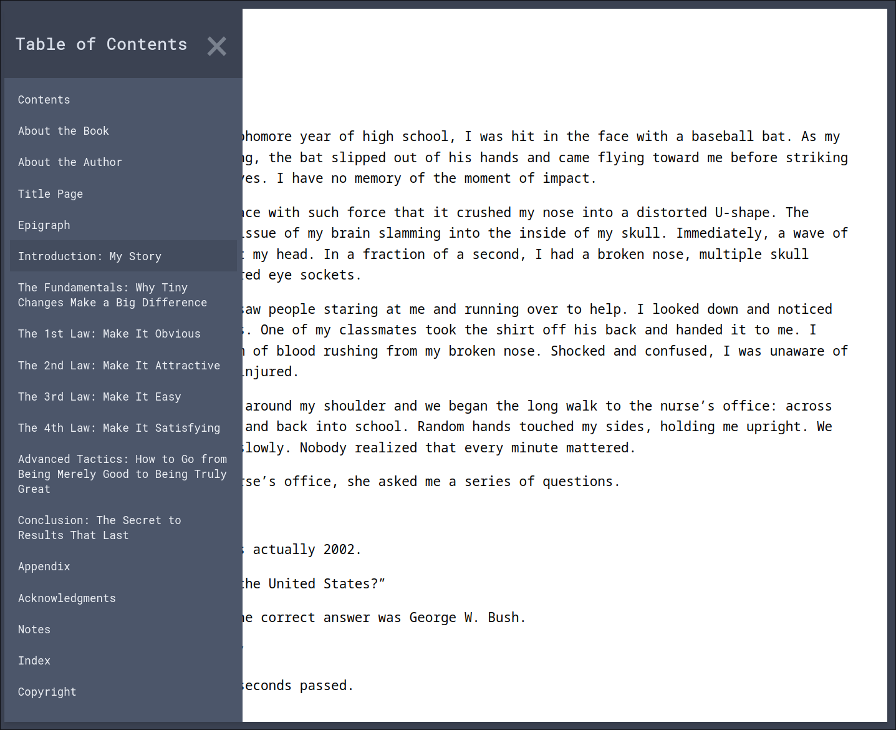
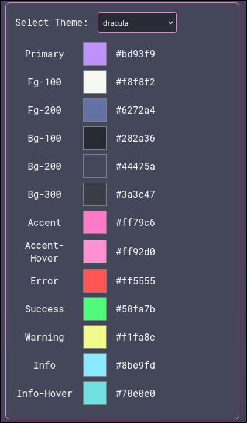

# TypeAlong

TypeAlong is a sleek, minimalistic typing game built with SvelteKit and TypeScript. It transforms your favorite EPUB books into immersive typing challenges, blending the joy of reading with the art of touch typing.

---

## Overview

TypeAlong isn’t just another typing game. It’s an innovative platform that lets you upload any EPUB book, choose a starting page or chapter, and type along to improve your speed and accuracy—all in a beautifully crafted, customizable interface. Inspired by the aesthetics and mechanics of MonkeyType, it also comes with extra features that make it a fun and unique experience.

---

## Features

- **EPUB Upload & Preview:** Upload your EPUB files, preview them, and select the starting page or chapter.
- **Spot Saving:** Your progress is saved automatically so you can pick up right where you left off.
- **Real-time Metrics:** Monitor your current page, words per minute (WPM), and accuracy as you type.
- **Typing Mode:** Enjoy a traditional typing game mode when you need a break from reading.
- **Customization:** Popular themes and color customization options to match your style.
- **Audio Effects:** Choose between two sets of typewriter noises to enhance your typing experience.
- **Responsive Design:** Optimized for desktops, tablets, and mobile devices.

---

## Getting Started

### Prerequisites

- Node.js and npm installed on your system.

### Installation

1. **Clone the repository:**

   ```bash
   git clone https://github.com/noway-code/TypeAlong.git
   ```

2. **Navigate to the project directory:**

   ```bash
   cd TypeAlong
   ```

3. **Install dependencies:**

   ```bash
   npm install
   ```

4. **Start the development server:**

   ```bash
   npm run dev
   ```
   
5. **In a separate terminal, make your virtual environment**

   ```bash
   python -m venv venv
   ```
   
6. **Activate your virtual environment**

   ```bash
    .\venv\Scripts\activate
    ```

7. **Install the required packages**
   
   ```bash
   pip install -r requirements.txt
   ```
   
8. **Run the server**

   ```bash
    cd backend
    uvicorn app.main:app --reload
    ```

9. **Open your browser:**  
   Navigate to [http://localhost:5173](http://localhost:5173) to see the app in action.

---

## Usage

- **Upload an EPUB:** Click the "Upload EPUB" button to load your favorite book.
- **Select Your Starting Point:** Choose the chapter or page from where you want to begin.
- **Type Away:** Start typing and enjoy real-time feedback on your progress, speed, and accuracy.
- **Alternate Modes:** Switch to a pure typing game mode whenever you want a change of pace.

---

## Screenshots

### Home Page


### Typing Mode


### Book Upload & Preview


### Customization Options


## Development Status
As of now, the project is in its early stages of development. The core features are functional, but there are still many improvements and enhancements to be made. Here are some of the planned updates:
- **Live Multiplayer:** Introduce real-time multiplayer typing games (book clubs).
- **Further Customization:** Add more themes, fonts, settings, and accessibility options.
- **Improved EPUB Handling:** Enhance the EPUB upload process and preview functionality.
- **Advanced Typing Metrics:** Add more detailed statistics and insights for users.
- **Leaderboards & Profiles:** Implement user profiles and leaderboards for a competitive edge.

## Development Insights

TypeAlong was born out of a need to create something that wasn’t just a toy project but a serious, impactful endeavor. While early development began with a MonkeyType clone tutorial, the journey evolved:

- **Research & Experimentation:** Extensive note-taking and iterative learning with Svelte, SvelteKit, and TypeScript helped shape the project’s foundation.
- **EPUB Integration:** Incorporating [epub.js](https://github.com/futurepress/epub.js) was challenging due to sparse documentation and legacy code examples. Overcoming these obstacles led to a unique, if initially rough, implementation.
- **Overcoming Challenges:** From grappling with technical debt to managing personal challenges (shoutout to my friend [Jacob](https://github.com/jdioso) for his constant UI/UX support and encouragement), TypeAlong is a testament to perseverance and creative problem-solving.

Want to read more about the development journey? Check out my [Blog Post](https://www.nowaycode.com/projects/typealong) for a detailed account of the project’s inception, challenges, and future plans.

---

## Contributing

Contributions are always welcome! If you have ideas, improvements, or bug fixes, please open an issue or submit a pull request. Your input helps make TypeAlong even better.

---

## License

This project is licensed under the [MIT License](LICENSE).

---

## Acknowledgments

- **Nord Theme:** For inspiring the calming and modern interface.
- **Svelte Community:** For providing an amazing framework and continuous support.
- **Jacob:** Special thanks to [Jacob](https://github.com/jdioso) whose UI/UX advice and unwavering support helped push this project forward.
- **Inspiration:** The innovative spirit behind typing games like MonkeyType and the endless pursuit of creative, impactful projects.

---

Enjoy TypeAlong—where reading meets typing, and every keystroke brings you closer to mastery!